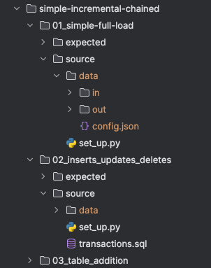
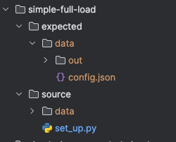

# CDC component


## Tests

Debezium based CDC components functional tests are defined using the [`datadir`](https://bitbucket.org/kds_consulting_team/datadirtest/src/master/) test framework. 
The functional tests are abstracted in the`db_components/debezium_core/tests` package. 

`TestDatabaseEnvironment` is the base class for JDBC connection to prepare the test environment. ]
It is initialized in the `DebeziumCDCDatadirTest` class and may be used in the `set_up.py` scripts to prepare the test cases.

- `prepare_initial_table(script_name)` - This method creates a test table using the provided SQL script.
  - The folder containing the scripts is defined by the `db_test_traits.set_sql_traits_folder(sql_traits_path)` method.

### DebeziumCDCDatadirTest 

[`DebeziumCDCDatadirTest`](./db_components/debezium/tests/functional.py) is the base class for all functional tests. It performs the following tasks:
- Initializes the `TestDatabaseEnvironment` and injects the instance into the `context_parameters['db_client']` variable of the test object.
  - This can be accessed from individual tests from the `set_up.py` script.
- Initializes and runs the component.
- Cleans up the results so they can be compared.
  - Removes the `KBC__EVENT_TIMESTAMP_MS` column from the result as this is dynamic value changing with each run.
  - Removes the `id` column from `debezium_signals` table as this is dynamically generated UUID.
  - The results are always sorted by the event order so we can safely delete these columns.

### Defining a new test

In the tests folder create the following:
- `functional` folder that contains the test case. (folder per each test case)
  - See examples in the [db_components/ex_postgres_cdc/tests/functional](./db_components/ex_postgres_cdc/tests/functional) folder.
- `test_functional.py` running the DataDir test
- `sql_test_traits` folder containing the SQL scripts for the test cases.
  - Example Postgres scripts are available in the [`/db_components/debezium/tests/db_test_traits`](./db_components/debezium/tests/db_test_traits) folder, these can be converted using ChatGPT into other SQL dialects.


`test_functional.py` should contain the following:

```python
import os
import unittest

from datadirtest import DataDirTester

from db_components.debezium.tests.db_test_traits import traits as db_test_traits
from db_components.debezium.tests.functional import DebeziumCDCDatadirTest


class TestComponent(unittest.TestCase):
    # @freeze_time("2024-02-03 14:50:42.833622")
    def test_functional(self):
        # Set the path to the SQL traits folder
        sql_traits_path = os.path.join(os.path.dirname(os.path.realpath(__file__)), 'sql_test_traits')
        db_test_traits.set_sql_traits_folder(sql_traits_path)
        functional_tests = DataDirTester(test_data_dir_class=DebeziumCDCDatadirTest)
        functional_tests.run()


if __name__ == "__main__":
    unittest.main()

```

### Example set_up.py - initial load

```python
from datadirtest import TestDataDir
from db_components.debezium.tests.functional import TestDatabaseEnvironment


def run(context: TestDataDir):
    # get value from the context parameters injected via DataDirTester constructor
    sql_client: TestDatabaseEnvironment = context.context_parameters['db_client']
    # prepare the initial sales table
    sql_client.prepare_initial_table('sales_table.sql')
    sql_client.create_signal_table()
    print("Running before script")

```

### Example set_up.py - increment

```python
import os
from datadirtest import TestDataDir
from db_components.debezium.tests.functional import TestDatabaseEnvironment


def get_transactions_queries():
    transactions_path = os.path.join(os.path.dirname(os.path.realpath(__file__)), 'transactions.sql')
    return str(open(transactions_path, 'r').read()).split(';')


def run(context: TestDataDir):
    # get value from the context parameters injected via DataDirTester constructor
    sql_client: TestDatabaseEnvironment = context.context_parameters['db_client']
    sql_client.connection.connect()

    schema = 'inventory'
    sql_client.perform_query(f'SET search_path TO {schema}')
    
    # run the transactions
    queries = get_transactions_queries()
    for q in queries:
        if q.strip():
            sql_client.perform_query(q)
    sql_client.perform_query('commit')
    sql_client.connection.close()
    print("Running before script")
```

### Chained tests

Use chained test to test the consecutive runs. E.g. initial load and then increments. The chained tests are ordered by name, and they pass state to each other.



### Simple tests

Single test runs:




## Installation

1. Clone this repository
2. Navigate to the debezium_core directory
3. Run mvn clean install, this will generate kbcDebeziumEngine-jar-with-dependencies.jar in the debezium_core/jars directory.

## License

MIT licensed, see [LICENSE](./LICENSE) file.
